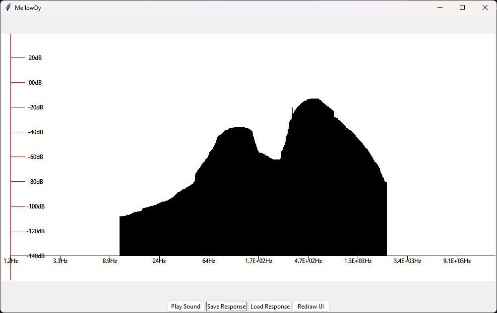

# MellowDy

Generates white noise from given frequency response.

[Sample generated audio](./noise.wav)

## Instructions

1. Draw desired frequency response with left mouse button.
2. Hit play sound to generate preview sound

## Features

- Save and load frequency response
- Logarithmic frequency response plot